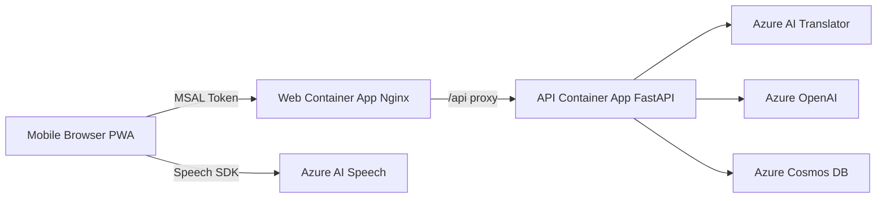

# Mobile Translator


A smartphone-first PWA that captures speech in real time, translates recognized text into Japanese with Azure AI Translator, and generates summaries plus Q&A assistance with Azure OpenAI.

- Speech recognition: browser Speech SDK with continuous recognition
- Translation: API-backed Japanese translation
- Summaries: recent summary (mini) and long summary (full)
- Q&A: topic generation and question generation
- Persistence: Cosmos DB (`mt` / `items` / partition key: `/sessionId`)

日本語ドキュメント: [README.md](README.md)

## Architecture



## Key Features

- Session lifecycle
  - Create sessions with title and source language
  - Manage segments, summaries, topics, and questions per session
- Live speech and translation
  - Save each recognition result as a segment
  - Attach Japanese translation per segment
- Summarization
  - Recent summary: auto-generated every 3 new segments while recording (also available manually)
  - Long summary: structured summary over the full session
- Q&A assistance
  - Generate candidate topics from recent summary
  - Generate bilingual (EN/JA) question from selected topic
- Export
  - Download utterances as JSON
  - Download full session items as Markdown

## Tech Stack

| Layer | Technology                                                       |
| ----- | ---------------------------------------------------------------- |
| Web   | React 18, TypeScript, Vite, MSAL, Azure Speech SDK, PWA          |
| API   | FastAPI, pydantic-settings, azure-identity, azure-cosmos, openai |
| Infra | Azure Developer CLI (azd), Bicep, Azure Container Apps, ACR      |
| Data  | Azure Cosmos DB for NoSQL                                        |
| AI    | Azure AI Translator, Azure OpenAI                                |
| Auth  | Microsoft Entra ID (SPA + API App Registration)                  |

## Repository Layout

```text
infra/            Azure infrastructure definition (Bicep)
scripts/          azd helper scripts (preprovision and env import)
src/api/          FastAPI backend
src/web/          React + PWA frontend
```

## Quick Start (Local)

### 1) API

```powershell
cd src\api
python -m venv .venv
.\.venv\Scripts\python -m pip install -r requirements.txt
copy .env.example .env
uvicorn app.main:app --reload
```

### 2) Web

```powershell
cd src\web
npm.cmd ci
copy .env.local.example .env.local
npm.cmd run dev
```

Open `http://localhost:5173`, sign in, create a session, and start recording.

## Azure Deployment (azd)

### 1) Sign in

```powershell
azd auth login
az login
```

### 2) Create environment

```powershell
azd env new mtrans-dev
```

### 3) Set required values

```powershell
azd env set AZURE_LOCATION japaneast
azd env set SPA_CLIENT_ID <spa-client-id>
azd env set API_AUDIENCE api://<api-app-client-id>
```

Notes:

- `scripts/preprovision.ps1` checks that `SPA_CLIENT_ID` and `API_AUDIENCE` are set
- You can bulk import from `.env` using `scripts/import-env-to-azd.ps1`

### 4) Deploy

```powershell
azd up
```

After first deployment, add `SERVICE_WEB_URI` to SPA App Registration Redirect URIs.

## Environment Variables at a Glance

### Root `.env.example` (for azd)

- `AZURE_LOCATION`
- `AZURE_OPENAI_LOCATION`
- `AZURE_SPEECH_LOCATION`
- `SPA_CLIENT_ID`
- `API_AUDIENCE`
- `API_SCOPE` (default: `access_as_user`)
- `PASSKEY_AUTH_CONTEXT_ID` (optional)
- `AZURE_OPENAI_DEPLOYMENT_MINI` / `AZURE_OPENAI_DEPLOYMENT_FULL`
- `AZURE_OPENAI_MODEL_MINI` / `AZURE_OPENAI_MODEL_FULL`

### API `.env` (local)

- `TENANT_ID`, `API_AUDIENCE`, `API_SCOPE`
- `AZURE_OPENAI_ENDPOINT`
- `SPEECH_REGION`, `SPEECH_ENDPOINT`, `SPEECH_RESOURCE_ID`
- `TRANSLATOR_ENDPOINT`, `TRANSLATOR_REGION`
- `COSMOS_ENDPOINT`, `COSMOS_DATABASE`, `COSMOS_CONTAINER`
- `CORS_ALLOWED_ORIGINS`

### Web `.env.local` (local)

- `VITE_TENANT_ID`
- `VITE_CLIENT_ID`
- `VITE_API_SCOPE` (full scope string)
- `VITE_API_BASE_URL`
- `VITE_PASSKEY_AUTH_CONTEXT_ID` (optional)

## API Endpoints

| Method | Path                                           | Description                  |
| ------ | ---------------------------------------------- | ---------------------------- |
| GET    | `/healthz`                                     | Health check                 |
| GET    | `/api/healthz`                                 | API health check             |
| POST   | `/api/speech/token`                            | Issue Speech SDK token       |
| POST   | `/api/sessions`                                | Create session               |
| GET    | `/api/sessions`                                | List sessions                |
| GET    | `/api/sessions/{id}`                           | Get all items in session     |
| POST   | `/api/sessions/{id}/segments`                  | Translate and store segment  |
| POST   | `/api/sessions/{id}/summary/recent`            | Generate recent summary      |
| POST   | `/api/sessions/{id}/summary/long`              | Generate long summary        |
| POST   | `/api/sessions/{id}/topics`                    | Generate topics              |
| POST   | `/api/sessions/{id}/topics/{topicId}/question` | Generate question            |
| GET    | `/api/sessions/{id}/segments/export`           | Export utterances as JSON    |
| GET    | `/api/sessions/{id}/items/export/markdown`     | Export all items as Markdown |

## Data Model

| type       | Description                                      |
| ---------- | ------------------------------------------------ |
| `session`  | Title, source language, owner user               |
| `segment`  | Source utterance, Japanese translation, sequence |
| `summary`  | `recent` / `long` summary                        |
| `topic`    | Candidate Q&A topic                              |
| `question` | Generated question (EN/JA)                       |

## Security and Auth

- No API keys required at runtime (managed identity first)
- API validates Bearer token claims: `tid` / `iss` / `aud` / `scp`
- Web uses Entra ID sign-in through MSAL
- API uses internal ingress, Web uses external ingress
- OpenAI / Translator / Cosmos / ACR are accessed through private endpoints

## Troubleshooting

- If you hit AADSTS500011
  - Ensure `API_AUDIENCE` points to API App Registration URI (`api://<api-app-id>`), not SPA
- If image pull fails in Container Apps
  - Wait for `AcrPull` RBAC propagation, then rerun `azd deploy`
- If ACA image OS errors occur with buildx
  - Build with `--platform linux/amd64 --provenance=false`

## Related Docs

- [README.md](README.md)
- [DEPLOYMENT-GUIDE.md](DEPLOYMENT-GUIDE.md)
- [azure.yaml](azure.yaml)
