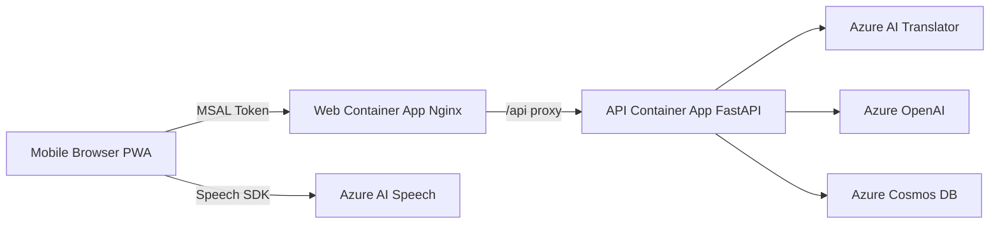

# Mobile Translator


スマートフォンのマイク入力をリアルタイムで取り込み、Azure AI Translator で日本語訳し、Azure OpenAI で要約とQ&A支援を行う PWA です。

- 音声認識: ブラウザの Speech SDK で連続認識
- 翻訳: API 経由で Azure AI Translator による日本語化
- 要約: 直近要約（mini）と長期要約（full）
- Q&A: トピック生成と質問生成
- 永続化: Cosmos DB (`mt` / `items` / partition key: `/sessionId`)

English documentation: [README-en.md](README-en.md)

## アーキテクチャ



## 主な機能

- セッション管理
  - タイトル・入力言語に加えて、任意のスピーカー名とセッション通し番号を指定してセッションを作成
  - セッションごとに発話、要約、トピック、質問を管理
- 音声入力と翻訳
  - 認識結果をセグメントとして保存
  - 各セグメントに日本語訳を付与
- 要約
  - 直近要約: 録音中に3セグメント増えるごとに自動生成（手動実行も可）
  - 長期要約: セッション全体から構造化要約を生成
- Q&A支援
  - 直近要約からトピックを生成
  - 選択トピックから英日質問文を生成
- エクスポート
  - 発話のみ JSON ダウンロード
  - セッション全データ Markdown ダウンロード

## 技術スタック

| レイヤー | 採用技術                                                         |
| -------- | ---------------------------------------------------------------- |
| Web      | React 18, TypeScript, Vite, MSAL, Azure Speech SDK, PWA          |
| API      | FastAPI, pydantic-settings, azure-identity, azure-cosmos, openai |
| Infra    | Azure Developer CLI (azd), Bicep, Azure Container Apps, ACR      |
| Data     | Azure Cosmos DB for NoSQL                                        |
| AI       | Azure AI Translator, Azure OpenAI                                |
| Auth     | Microsoft Entra ID (SPA + API App Registration)                  |

## リポジトリ構成

```text
infra/            Azure インフラ定義 (Bicep)
scripts/          azd 事前処理・env 取り込みスクリプト
src/api/          FastAPI バックエンド
src/web/          React + PWA フロントエンド
```

## クイックスタート（ローカル）

### 1) API

```powershell
cd src\api
python -m venv .venv
.\.venv\Scripts\python -m pip install -r requirements.txt
copy .env.example .env
uvicorn app.main:app --reload
```

### 2) Web

```powershell
cd src\web
npm.cmd ci
copy .env.local.example .env.local
npm.cmd run dev
```

`http://localhost:5173` を開いてサインイン後、セッション作成と録音を実行します。

## Azure デプロイ（azd）

### 1) 認証

```powershell
azd auth login
az login
```

### 2) 環境作成

```powershell
azd env new mtrans-dev
```

### 3) 必須値設定

```powershell
azd env set AZURE_LOCATION japaneast
azd env set SPA_CLIENT_ID <spa-client-id>
azd env set API_AUDIENCE api://<api-app-client-id>
```

補足:

- `azd up` / `azd provision` 時は `azure.yaml` に従って、Windows では `scripts/preprovision.ps1`、POSIX 環境では `scripts/preprovision.sh` が自動実行されます
- `scripts/preprovision.ps1` も `SPA_CLIENT_ID` と `API_AUDIENCE` の未設定チェックを行います
- `.env` から一括投入する場合は `scripts/import-env-to-azd.ps1` が使えます

### 4) デプロイ

```powershell
azd up
```

初回デプロイ後は、`SERVICE_WEB_URI` を SPA App Registration の Redirect URI に追加してください。

## 環境変数の要点

### ルート `.env.example`（azd 用）

- `AZURE_LOCATION`
- `AZURE_OPENAI_LOCATION`
- `AZURE_SPEECH_LOCATION`
- `SPA_CLIENT_ID`
- `API_AUDIENCE`
- `API_SCOPE`（既定: `access_as_user`）
- `PASSKEY_AUTH_CONTEXT_ID`（任意）
- `AZURE_OPENAI_DEPLOYMENT_MINI` / `AZURE_OPENAI_DEPLOYMENT_FULL`（実際に Azure OpenAI に作成済みのデプロイ名に合わせる）
- `AZURE_OPENAI_MODEL_MINI` / `AZURE_OPENAI_MODEL_FULL`（Bicep が Azure OpenAI デプロイを作る際のモデル名。API ランタイムでは未使用）

### API `.env`（ローカル）

- `TENANT_ID`, `API_AUDIENCE`, `API_SCOPE`
- `AZURE_OPENAI_ENDPOINT`
- `SPEECH_REGION`, `SPEECH_ENDPOINT`, `SPEECH_RESOURCE_ID`（Speech SDK 用トークン発行に必須。Azure デプロイ時は自動設定）
- `TRANSLATOR_ENDPOINT`, `TRANSLATOR_REGION`（Azure デプロイ時の `TRANSLATOR_REGION` は `AZURE_LOCATION` と同じ値が設定される）
- `COSMOS_ENDPOINT`, `COSMOS_DATABASE`, `COSMOS_CONTAINER`
- `CORS_ALLOWED_ORIGINS`

### Web `.env.local`（ローカル）

- `VITE_TENANT_ID`
- `VITE_CLIENT_ID`
- `VITE_API_SCOPE`（完全な scope 文字列）
- `VITE_API_BASE_URL`
- `VITE_PASSKEY_AUTH_CONTEXT_ID`（任意）

## API エンドポイント

| Method | Path                                           | 説明                             |
| ------ | ---------------------------------------------- | -------------------------------- |
| GET    | `/healthz`                                     | ヘルスチェック                   |
| GET    | `/api/healthz`                                 | API ヘルスチェック               |
| POST   | `/api/speech/token`                            | Speech SDK 用トークン発行        |
| POST   | `/api/sessions`                                | セッション作成                   |
| GET    | `/api/sessions`                                | セッション一覧                   |
| GET    | `/api/sessions/{id}`                           | セッション内全アイテム取得       |
| POST   | `/api/sessions/{id}/segments`                  | セグメント翻訳・保存             |
| POST   | `/api/sessions/{id}/summary/recent`            | 直近要約生成                     |
| POST   | `/api/sessions/{id}/summary/long`              | 長期要約生成                     |
| POST   | `/api/sessions/{id}/topics`                    | トピック生成                     |
| POST   | `/api/sessions/{id}/topics/{topicId}/question` | 質問生成                         |
| GET    | `/api/sessions/{id}/segments/export`           | セッション情報付き発話 JSON ファイルをダウンロード |
| GET    | `/api/sessions/{id}/items/export/markdown`     | セッション全文書 Markdown ファイルをダウンロード |

## データモデル

| type       | 説明                             |
| ---------- | -------------------------------- |
| `session`  | タイトル、入力言語、任意のスピーカー名・通し番号、所有ユーザー |
| `segment`  | 発話原文、和訳、連番             |
| `summary`  | `recent` / `long` 要約           |
| `topic`    | Q&A 候補トピック                 |
| `question` | 生成質問（英語/日本語）          |

## セキュリティ・認証

- API キー非依存（Managed Identity ベース）
- API は Bearer token の `tid` / `iss` / `aud` / `scp` を検証
- Web は Entra ID サインイン（MSAL）
- API は内部 Ingress、Web は外部 Ingress
- OpenAI / Translator / Cosmos / ACR は Private Endpoint を利用

## トラブルシュート

- AADSTS500011 が出る場合
  - `API_AUDIENCE` は SPA ではなく API App Registration の URI (`api://<api-app-id>`) を設定
- Container Apps で pull 失敗する場合
  - `AcrPull` ロール反映に数分かかるため、待ってから `azd deploy` を再実行
- Docker buildx で ACA イメージエラーが出る場合
  - `--platform linux/amd64 --provenance=false` を付けてビルド

## 参考ドキュメント

- [README-en.md](README-en.md)
- [DEPLOYMENT-GUIDE.md](DEPLOYMENT-GUIDE.md)
- [azure.yaml](azure.yaml)
